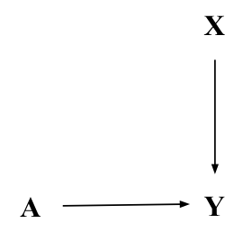

# stat27420_final_project

**Published paper we wish to replicate the results of:**
- “Racial Discrimination in the Sharing Economy: Evidence from a Field Experiment” https://pubs.aeaweb.org/doi/pdfplus/10.1257/app.20160213
  - This paper explores the effect of the perceived race of a guest on the likelihood a host accepts the booking request. 
  - It measures this effect using linear probability models with and without covariates (host, neighborhood, and property characteristics).
  - The original researchers conducted a randomized experiment in 5 different cities, creating fake AirBnB accounts and using them to request bookings.
- GitHub with data (AirBnB repository): https://github.com/gsbDBI/ExperimentData/blob/master/AirBnB/20160213_data/hosts.dta 

**Research Question:** Does the perceived race of a guest (signaled by name) causally affect the likelihood that a host accepts the booking request?

**A** = Treatment: Race-sounding name of guest (African American vs. white)

**Y** = Outcome: Whether the host accepts the booking request (binary)

**X** = Covariates:
- Host race, gender, age
- Host’s prior reviews (including whether any past guests were African American)
- Property price, type, number of reviews
- Neighborhood demographics

**Causal DAG:**

There are no unmeasured confounders in the DAG above, so controlling for X (the covariates) is not necessary. However, by controlling for X, we can estimate CATEs.

**Analysis Plan:**
1. Estimate ATE using ML.
2. Estimate CATEs to explore heterogeneity by host, neighborhood, and property characteristics (X).
3. Compare ML-based ATE and CATEs to those from the paper's linear regression.

**Dividing Work:**
- Maya: CATE (restrict to black/white hosts), CATE (restrict to diverse neighborhoods)
- Olivia: ATE, CATE (restrict to hosts who have had black guests in the past--observational data)
